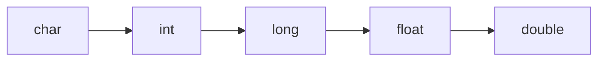
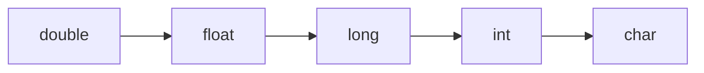

## Hello world

```cs
class Prog{
	static void Main(){
		System.Console.WriteLine("Hello world");
	}
}
```

```cs
WriteLine();
Write();
ReadLine();
ReadKey();
```

## O'zgaruvchilarni turlari

```cs
int    myNum       = 5;
double myDoubleNum = 5.99D;
char   myLetter    = 'D';
bool   myBool      = true;
string myText      = "Hello";
```

```cs
//const type var = value; 
const int x = 3; // o'zgarmas qiymat beriladi const yordamida
```

| Tur    | Xotira  | Hajmi                       |
|--------|---------|-----------------------------|
| int    | 4 bytes | +-2 147 483 647             |
| long   | 8 bytes | +-9 223 372 036 854 775 807 |
| float  | 4 bytes | (,) keyin 7ta               |
| double | 8 bytes | (,) keyin 15ta              |
| bool   | 1 bit   | true false(rost yolg'on)    |
| char   | 2 bytes | 1 ta simvol                 |

## 1 turdan 2-turga o'tkazish

Anniq emas o'zlashtirish



```cs
int myInt = 9;
double myDouble = myInt;
```

Anniq o'zlashtirish



```cs
double myDouble = 9.78;
int myInt = (int) myDouble;
```

Metodlari:

```cs
Convert.ToString(myInt);    // convert int to string
Convert.ToDouble(myInt);    // convert int to double
Convert.ToInt32(myDouble);  // convert double to int
Convert.ToString(myBool);	// convert bool to string

// yuqoridagilardn ossonroq metod
int.Parse()
double.Parse()
String.Parse()
float.Parse()
```

Nomi          | Amali                              |
--------------|------------------------------------|
Matematik     |  + - * / % ++ --                   |
O'zlashtirish | = += -= *= /= %= &= \|= ^= >>= <<= |
Tenglik       | == != < > <= >=                    |
Logik         | && \|\| !                          |

```cs
using static System.Math;

Max(x,y); 
Min(x,y);

Abs(x);
Round(X); // yaxlitlash
```

# OOP (obyekt class modullar)

`prog2.cs` va `prog.cs` yaratamiz ...

```cs
class Car{
  public string color = "red";
}
```
```
using System; // nomlar fazosiga murojat
using static System.Console; // static classga murojat
```

```cs
class Program{
  static void Main(){
    Car myObj = new Car();
    WriteLine(myObj.color);
  }
}
```

## Obyekt yaratish

```cs
class Car{
  string model;
  string color;
  int year;

  static void Main(){
    Car Ford = new Car(); // 1-obyekt
    Ford.model = "Mustang";
    Ford.color = "red";
    Ford.year = 1969;

    Car Opel = new Car(); // 2-obyekt
    Opel.model = "Astra";
    Opel.color = "white";
    Opel.year = 2005;

    WriteLine(Ford.model);
    WriteLine(Opel.model);
  }
}
```

## konstruktor

```cs
class Car{
  public string model;  // maydon
  
  public Car(){ // konstruktor
    model = "Mustang";
  }

  static void Main(){
    Car Ford = new Car();	// obyekt yaratildi
    WriteLine(Ford.model);	// qiymat chop etildi
  }
}
```

# CSharp klass, struktura, this, metid, maydon va obyekt kalit so'zlari

```csharp
class Person{
    public string name;
    public int    age;
 
    public Person()            : this("Неизвестно"){}
    public Person(string name) : this(name, 18){}
    
    public Person(string name, int age){
        this.name = name;
        this.age  = age;
    }
    
    public void GetInfo(){
        WriteLine($"Имя: {name}  Возраст: {age}");
    }
}
```

## obyekt yaratgan paytda maydonlarga qiymat berish

```csharp
Person tom = new Person { name = "Tom", age=31 };
tom.GetInfo();          // Имя: Tom  Возраст: 31
```

## public, private, protected, internal va getset

```cs
class Person{
  private string name; // field
  
  public string Name{
    get { return name; }   // getter
    set { name = value; }  // setter
  }
}
```

## vorislik

```cs
class Vehicle{ // class bobo classi yaratildi
  public string brand = "Ford";
  
  public void honk(){
    WriteLine("Tuut, tuut!");
  }
}

class Car : Vehicle{ // class farzandi
  public string modelName = "Mustang";  // Car field
}

class Program{
  static void Main(){
    Car myCar = new Car(); // obyekti
	myCar.honk();
    WriteLine(myCar.brand + " " + myCar.modelName);
  }
}
```

## virtual va override kalit so'zlari

```cs
class Animal{
  public virtual void animalSound(){
    WriteLine("The animal makes a sound");
  }
}

class Pig : Animal{
  public override void animalSound(){
    WriteLine("The pig says: wee wee");
  }
}

class Dog : Animal{
  public override void animalSound(){
    WriteLine("The dog says: bow wow");
  }
}

class Program{
  static void Main(string[] args){
    Animal myAnimal = new Animal();  // Create a Animal object
    Animal myPig    = new Pig();  // Create a Pig object
    Animal myDog    = new Dog();  // Create a Dog object

    myAnimal.animalSound();
    myPig.animalSound();
    myDog.animalSound();
  }
}

// The animal makes a sound
// The pig says: wee wee
// The dog says: bow wow
```

```cs
// Abstract class
abstract class Animal{
  // Abstract method (does not have a body)
  public abstract void animalSound();
  
  // Regular method
  public void sleep(){
    WriteLine("Zzz");
  }
}

// Derived class (inherit from Animal)
class Pig : Animal{
  public override void animalSound(){
    // The body of animalSound() is provided here
    Console.WriteLine("The pig says: wee wee");
  }
}

class Program{
  static void Main(){
    Pig myPig = new Pig(); // Create a Pig object
    
    myPig.animalSound();  // Call the abstract method
    myPig.sleep();  // Call the regular method
  }
}
```

## Interfeys

```cs
// Interface
interface IAnimal{
  void animalSound(); // interface method (does not have a body)
}

// Pig "implements" the IAnimal interface
class Pig : IAnimal{
  public void animalSound(){
    // The body of animalSound() is provided here
    WriteLine("The pig says: wee wee");
  }
}

class Program{
  static void Main(){
    Pig myPig = new Pig();  // Create a Pig object
    myPig.animalSound();
  }
}
```

## Enumiratsya (ajoyib narsa)

```cs
class Program{
  enum Level{
    Low,
    Medium,
    High
  }

  static void Main(string[] args){
    Level myVar = Level.Medium;
    WriteLine(myVar);
  }
}
// Результат будет:
// Medium
```

## Matin metidlari

```cs
string txt = "ABCDEFGHIJKLMNOPQRSTUVWXYZ";

txt.Length; // matin o'lchami

txt.ToLower();    // kichik harflarda
txt.ToUpper();    // katta harflarda
txt.IndexOf("E"); // E ni indexni qaytaradi
txt.Substring(i); // i raqamdegi indexda turgan elementni oladi
```

## Operatorlar

```cs
if(bool){code}
if(bool){code}else{code}
if(bool){code}else if(bool){code}else{code}

switch(val){case 1: code; break; default: code;};

while(bool){code}
do{code}while(bool)

for(head; bool; speed){code}
foreach(type val in arr){ code }
// break continue
```

## Massivlar

```cs
// int[] arr;
int[] arr = new int[]{1,2,3};
int[] arr = {1,2,3}; // 3ta elementdan iborat massiv hosil qildik

int x = arr[0]; // 0 - elementni olish

Array.Sort(arr); // tahleydi

using System.Linq;

arr.Max(); // eng kattasi
arr.Min(); // eng kichigi
arr.Sum(); // yig'indisi

string[] cars = new string[4]; // 4 ta elementdan iborat matin massivi
string[] cars = new string[4] {"Volvo", "BMW", "Ford", "Mazda"};
string[] cars = new string[] {"Volvo", "BMW", "Ford", "Mazda"};
string[] cars = {"Volvo", "BMW", "Ford", "Mazda"};
```

## Metidlar

```cs
class Program{
  static void MyMethod(){ // e'lon qilish
    // code to be executed
  }

  static void Main(){
    MyMethod(); // chaqirish
  }
}
```

## Nom berib ketish

```cs
static void MyMethod(string country="Norway "){
  Console.WriteLine(country);
}

static void Main(string[] args){
  MyMethod("Sweden ");
  MyMethod("India ");
  MyMethod(); // berilgan qiymat qiymati o'tadi
  MyMethod("USA ");
}

// Sweden India Norway USA
```

## Metidni qayta yuklash

```cs
int    MyMethod(int x)

float  MyMethod(float x)

double MyMethod(double x, double y)
```

# Fayillar bilan ishlash

```cs
using System.IO;  // include the System.IO namespace

File.SomeFileMethod();  // use the file class with methods
```

| Method         | Description          |
|----------------|----------------------|
| AppendText()   | matin qo'shadi       |
| Copy()         | Copies a file        |
| Create()       | yaratadi             |
| Delete()       | o'chiradi            |
| Exists()       | borligini tekshiradi |
| ReadAllText()  | o'qiydi              |
| Replace()      | almashtiradi         |
| WriteAllText() | yozadi               |

## Faylga solish va o'qish

```cs
using System.IO;  // include the System.IO namespace

string writeText = "Hello World!";
File.WriteAllText("filename.txt", writeText);
// Create a file and write the content of writeText to it

string readText = File.ReadAllText("filename.txt");
// Read the contents of the file
Console.WriteLine(readText);

// Hello World!
```

# Hatoni kuzatadi

```cs
try{
  int[] myNumbers = {1, 2, 3};
  Console.WriteLine(myNumbers[10]);
}catch(Exception e){
  Console.WriteLine(e.Message);
}
```

## finally

```cs
try{
  int[] myNumbers = {1, 2, 3};
  Console.WriteLine(myNumbers[10]);
}catch (Exception e){
  Console.WriteLine("Something went wrong.");
}finally{
  Console.WriteLine("The 'try catch' is finished.");
}

// hatoni chaqiradi
// throw new ArithmeticException("You must be at least 18 years old.");
```
