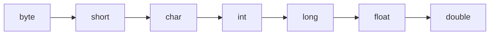
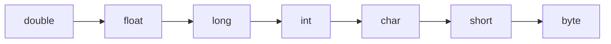

# Java dasturlash tilida dasturlash

java jdk o'rnatib olamiz.

main.java nomli fayl ochib ichiga quyidegilarni yozamiz:

```java
public class Main{
  public static void main(String[] args){
    System.out.println("hello world");
  }
}
```

### Ma'lumotlar turlari

```Java
String  name       = "Adxamjon";
int     age        = 24;
float   myFloatNum = 5.99f;
char    myLetter   = 'D';
boolean myBool     = true;
```

- - -

### Qanday ma'lumot xotradan qancha joy egallashi

| type    | xotira  | hajm                        |
|---------|---------|-----------------------------|
| byte    | 1 byte  | +-127                       |
| short   | 2 bytes | +-32 767                    |
| int     | 4 bytes | +-2 147 483 647             |
| long    | 8 bytes | +-9 223 372 036 854 775 807 |
| float   | 4 bytes | (,) keyin 6 to 7            |
| double  | 8 bytes | (,) keyin 15                |
| boolean | 1 bit   | true false                  |
| char    | 2 bytes | ASCII                       |

- - -

### 1 turdan 2-turga o'tkazish



```java
int myInt = 9;
double myDouble = myInt;
```




```java
double myDouble2 = 9.78;
int myInt = (int) myDouble2;
```

### Matinlar uchun metdlar

```java
String txt = "matin 'text'";
txt.length();
txt.toUpperCase() txt.toLowerCase()
txt.indexOf('text') // text boshlanish indexnini qaytaradi.
```

matinlar ichida ishlatish mumkin bo'lgan simvollar

| code | simvol | nomi            |
|------|--------|-----------------|
| \'   | '      | tirnoq          |
| \"   | "      | qo'sh tirnoq    |
| \\   | \      | Backslash       |
| \n   |        | yangi qator     |
| \r   |        | Carriage Return |
| \t   |        | Tab             |
| \b   |        | Backspace       |
| \f   |        | Form Feed       |


## Fayillar bilan ishlash

### Yayl yaratish

```java
import java.io.File;

File myObj = new File("filename.txt");
```

| Method            | Type     | Description                                    |
|-------------------|----------|------------------------------------------------|
| canRead()         | Boolean  | Tests whether the file is readable or not      |
| canWrite()        | Boolean  | Tests whether the file is writable or not      |
| createNewFile()   | Boolean  | Creates an empty file                          |
| delete()          | Boolean  | Deletes a file                                 |
| exists()          | Boolean  | Tests whether the file exists                  |
| getName()         | String   | Returns the name of the file                   |
| getAbsolutePath() | String   | Returns the absolute pathname of the file      |
| length()          | Long     | Returns the size of the file in bytes          |
| list()            | String[] | Returns an array of the files in the directory |
| mkdir()           | Boolean  | Creates a directory                            |

```Java
import java.io.File;  
// Import the File class
import java.io.IOException;  
// Import the IOException class to handle errors

public class CreateFile {
  public static void main(String[] args) {
    try {
      File myObj = new File("filename.txt");
      if (myObj.createNewFile()) {
        System.out.println("File created: " + myObj.getName());
      } else {
        System.out.println("File already exists.");
      }
    } catch (IOException e) {
      System.out.println("An error occurred.");
      e.printStackTrace();
    }
  }
}
```

Quyidegi ko'rinishdaham faylga murojat qilsa bo'ladi

```Java
File myObj = new File("C:\\Users\\MyName\\filename.txt");
```

### Yozish

```java
import java.io.FileWriter;   // Import the FileWriter class
import java.io.IOException;  // Import the IOException class to handle errors

public class WriteToFile {
  public static void main(String[] args) {
    try {
      FileWriter myWriter = new FileWriter("filename.txt");
      myWriter.write("Files in Java might be tricky, but it is fun enough!");
      myWriter.close();
      System.out.println("Successfully wrote to the file.");
    } catch (IOException e) {
      System.out.println("An error occurred.");
      e.printStackTrace();
    }
  }
}
```

### O'qish

```java
import java.io.File;  
// Import the File class
import java.io.FileNotFoundException;  
// Import this class to handle errors
import java.util.Scanner; 
// Import the Scanner class to read text files

public class ReadFile {
  public static void main(String[] args) {
    try {
      File myObj = new File("filename.txt");
      Scanner myReader = new Scanner(myObj);
      while (myReader.hasNextLine()) {
        String data = myReader.nextLine();
        System.out.println(data);
      }
      myReader.close();
    } catch (FileNotFoundException e) {
      System.out.println("An error occurred.");
      e.printStackTrace();
    }
  }
}
```

### fayl haqida ma'lumot

```java
import java.io.File;  // Import the File class

public class GetFileInfo {
  public static void main(String[] args) {
    File myObj = new File("filename.txt");
    if (myObj.exists()) {
      System.out.println("File name: " + myObj.getName());
      System.out.println("Absolute path: " + myObj.getAbsolutePath());
      System.out.println("Writeable: " + myObj.canWrite());
      System.out.println("Readable " + myObj.canRead());
      System.out.println("File size in bytes " + myObj.length());
    } else {
      System.out.println("The file does not exist.");
    }
  }
}
```

### Faylni o'chirish

```java
import java.io.File;  // Import the File class

public class DeleteFile {
  public static void main(String[] args) {
    File myObj = new File("filename.txt");
    if (myObj.delete()) {
      System.out.println("Deleted the file: " + myObj.getName());
    } else {
      System.out.println("Failed to delete the file.");
    }
  }
}
```

### Papkani o'chirish

```java
import java.io.File;

public class DeleteFolder {
  public static void main(String[] args) {
    File myObj = new File("C:\\Users\\MyName\\Test");
    if (myObj.delete()) {
      System.out.println("Deleted the folder: " + myObj.getName());
    } else {
      System.out.println("Failed to delete the folder.");
    }
  }
}
```

### Javaning asosiy shart va takrorlanuvchi operatorlari

```java
if(false){/*code*/}else{/*code*/}
switch(x){case 1: /*code*/ break; default: /*code*/};
while(false){}
do{/*code*/}while(false);
for(;;){/*code*/}
for(type var:vars){/*code*/} // foreach :
// break continue sikldan chiqsh o'tkazish
```

- - -

### Massivlar

```java
int[] arr = {12,23}; // massiv hosil qilish
arr[0]; // massivni chaqirish
arr.length

int[][] arr={{},{},{}};
```

- - -

### Metodlar (Funksylar)

```java
static void myMethod(String name, int age){/*code*/}  // void int
Math.max(x,y) // min(x,y) sqrt(x) abs(x) random() 0,0..1,0
final // konstanta
```

### OOP (class va obyektlar)

```java
public class Car {// class yaratish
  int    modelYear;
  String modelName;

  public Car(int year, String name) {
    modelYear = year;
    modelName = name;
  }

  public static void metod(String[] args) {
    Car myCar = new Car(1969, "Mustang"); // obyekt yaratish
    
    System.out.println(myCar.modelYear + " " + myCar.modelName);
  }
} // public private protected

public abstract void study(); // abstract tanasiga ega bo'lmedi uni avlodi ega faqat

class Student extends Main{
  public void study(){/*code*/};
} //sherda

// inkapsulatsya privat qib get set bilan olish, this.name = name;
```

### Konsoldan kiritish

```java
import java.util.Scanner;

// import package.name.Class;

Scanner myobj = new Scanner(System.in);

String userName = myobj.nextLine(); // malumot kiritng

// nextDouble() nextInt() nextChar()
```

### Shaxshiy paket yaratish

*Java paketlari papkalar strukturasiga o'xshedi*

```md
masalan
  └── root
    └── mypack
      └── MyPackageClass.java

Чтобы создать пакет, используйте package ключевое слово:
```

*MyPackageClass.java*

```java
package mypack;

class MyPackageClass {
  public static void main(String[] args) {
    System.out.println("This is my package!");
  }
}
```

Сохраните файл как MyPackageClass.java и скомпилируйте его:

```console
C:\Users\Your Name>javac MyPackageClass.java
Затем скомпилируйте пакет:

C:\Users\Your Name>javac -d . MyPackageClass.java
Это заставляет компилятор создать пакет «mypack».
```

*-d Ключевое слово указывает место для куда сохранить файл класса.
Вы можете использовать любое имя каталога, например c:/user (windows), или,
если вы хотите сохранить пакет в том же каталоге,
вы можете использовать знак точки « .», как в примере выше.*

*Примечание. Имя пакета следует писать в нижнем регистре,
чтобы избежать конфликта с именами классов.*

*Когда мы скомпилировали пакет в приведенном выше примере,
была создана новая папка с именем «mypack».*

*Чтобы запустить файл MyPackageClass.java, напишите следующее:*

```console
C:\Users\Your Name>java mypack.MyPackageClass

Результат будет:
This is my package!
```

- - -

### interfeys

```java
interface Animal{
  public void sleep();
}

class Pig implements Animal{}
// abstraksyaga o'xshedi public abstrackt
```

### enumiratsya

```java
enum Level{
  LOW,
  MEDIUM,
  HIGH,
}

Level myVar = Level.MEDIUM;

// Level.values()
// Level.MEDIUM => MEDIUM
```

### massiv

```java
import java.time.LocalDate;

LocalDate myObj = LocalDate.now();

import java.util.ArrayList;

ArrayList<String> arr = new ArrayList<String>();

arr.add("text");
arr.get(0);
arr.set(0, "text2");
arr.remove(0);
arr.clear();
arr.size(); // length
```

### Collecsya

```java
import java.util.Collactions;

Collections.sort(arr);

import java.util.LinkedList;

LinkedList<int> arr = new LinkedList<int>(); // arrayList bilan birxil

addFirst()    // Adds an item to the beginning of the list.
addLast()     // Add an item to the end of the list
removeFirst() // Remove an item from the beginning of the list.
removeLast()  // Remove an item from the end of the list
getFirst()    // Get the item at the beginning of the list
getLast()     // Get the item at the end of the list
```

### Hato

```java
try{}catch(Exception e){}finally{}    // hatoni tekshirish
throw new ArithmeticException("asd"); // hato qaytarish
```

### Patoklar bilan ishlash

```java
public class Main extends Thread{
  public static void main(String[] args){
    Main thread = new Main();
    thread.start()
  }

  public void run(){}
}
```

### arrow function and foreach

```java
import java.util.function.Consumer;

Consumer<Interger> method = (n) -> {System.out.println(n);};

arr.forEach(method);
```

- - -


